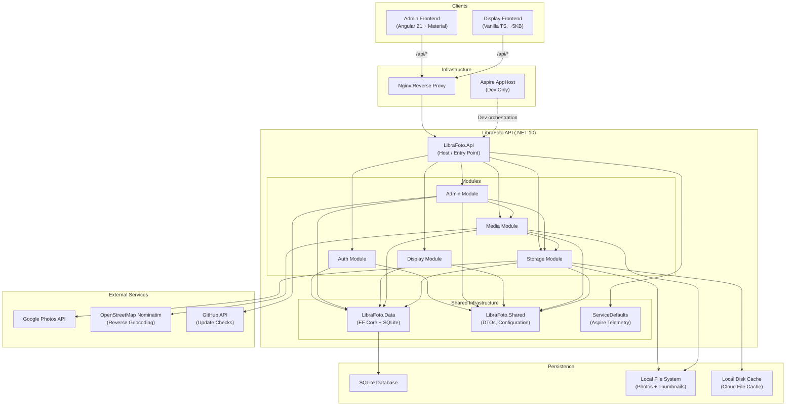
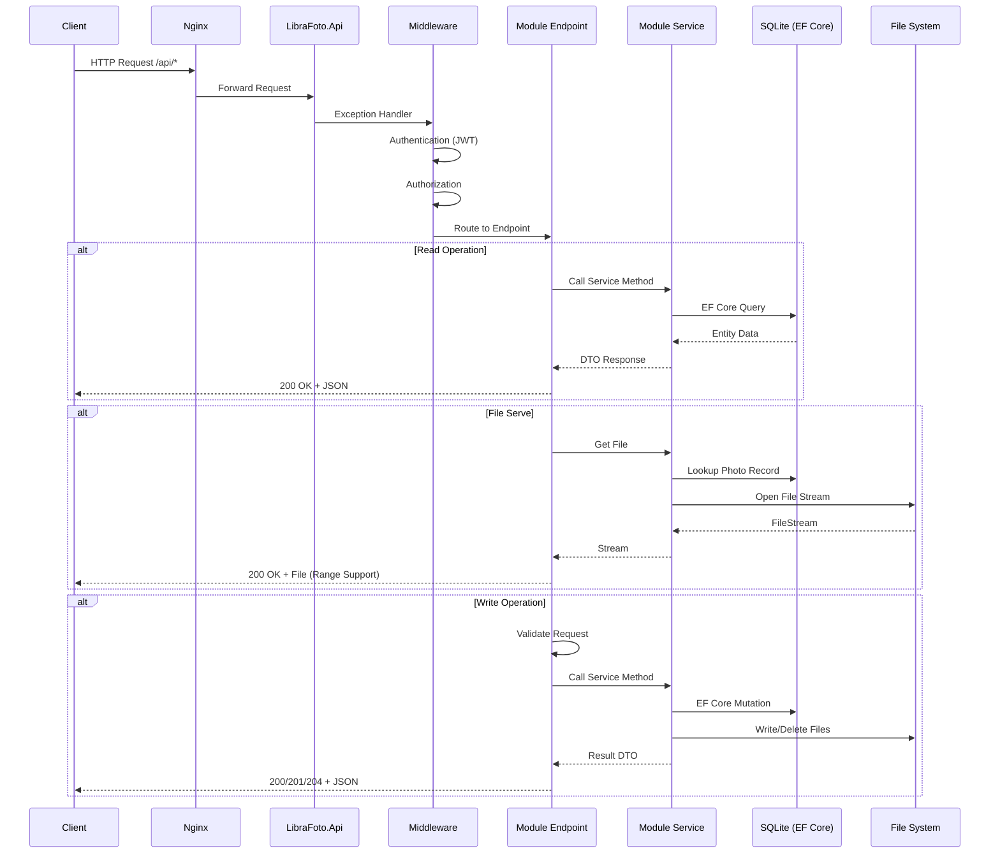
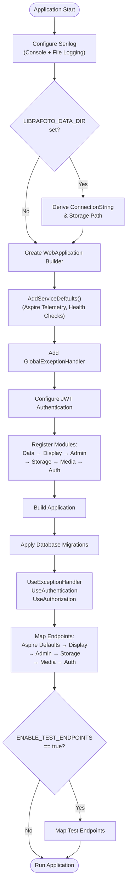
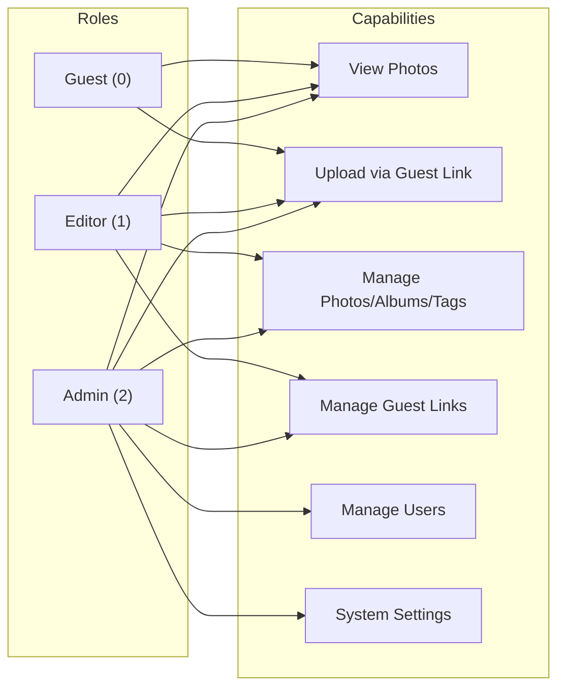

# LibraFoto API — Architecture Overview

## High-Level Architecture

LibraFoto is a **modular monolith** built on .NET 10 with ASP.NET Core Minimal APIs. The API serves two frontend applications (Admin Angular SPA and Display vanilla TypeScript) through an Nginx reverse proxy in production.

## Module Responsibilities

| Module      | Purpose                        | Key Capabilities                                                                                                                                       |
| ----------- | ------------------------------ | ------------------------------------------------------------------------------------------------------------------------------------------------------ |
| **Auth**    | Authentication & authorization | JWT login/logout, token refresh, user CRUD, role-based access (Admin/Editor/Guest), guest upload links, first-run setup                                |
| **Admin**   | Content management             | Photo CRUD, album management, tag management, bulk operations, system info & updates                                                                   |
| **Display** | Slideshow engine               | Photo sequencing with in-memory queue, display settings CRUD, QR code config, multiple display configurations                                          |
| **Media**   | Media processing               | Photo/video file serving, thumbnail generation (400×400 JPEG), EXIF metadata extraction, reverse geocoding, image processing (resize, rotate, convert) |
| **Storage** | Storage abstraction            | Multi-provider support (Local, Google Photos), file upload (single/batch/guest), sync engine, OAuth flows, Google Photos Picker, LRU disk cache        |

## Request Flow

## Startup Pipeline

## Authentication & Authorization Model

## Technology Stack

| Layer                   | Technology                                 |
| ----------------------- | ------------------------------------------ |
| **Runtime**             | .NET 10                                    |
| **Web Framework**       | ASP.NET Core Minimal APIs                  |
| **Database**            | SQLite via EF Core 10                      |
| **Authentication**      | JWT Bearer (BCrypt password hashing)       |
| **Image Processing**    | SixLabors.ImageSharp                       |
| **Metadata Extraction** | MetadataExtractor                          |
| **Geocoding**           | OpenStreetMap Nominatim                    |
| **Logging**             | Serilog (Console + Rolling File)           |
| **Observability**       | .NET Aspire (OpenTelemetry, Health Checks) |
| **Unique IDs**          | NanoId (for guest links)                   |
| **Google Integration**  | Google.Apis.Auth (OAuth 2.0)               |
| **Admin Frontend**      | Angular 21 + Angular Material              |
| **Display Frontend**    | Vanilla TypeScript (Vite)                  |
| **Reverse Proxy**       | Nginx                                      |
| **Containerization**    | Docker + Docker Compose                    |
