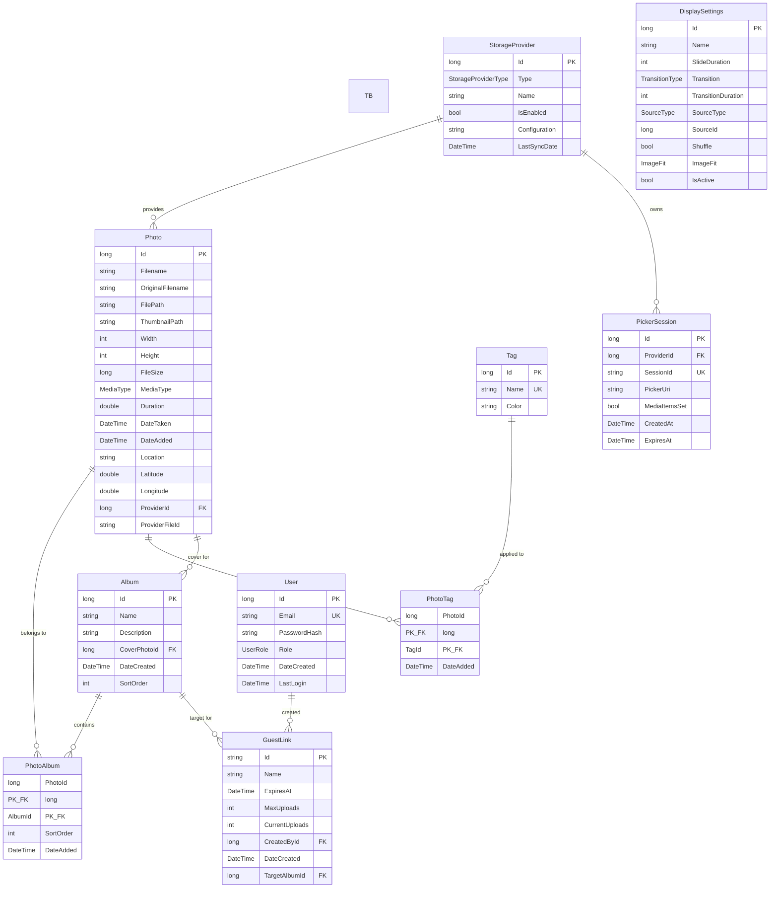
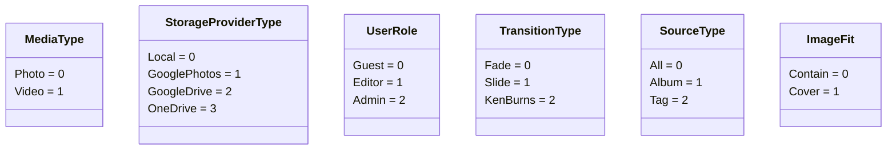

# LibraFoto API — Data Model

## Entity Relationship Diagram

## Enumerations

## Delete Behavior Map

| Relationship                    | On Delete   | Effect                                  |
| ------------------------------- | ----------- | --------------------------------------- |
| StorageProvider → Photo         | **SetNull** | Photos remain; `ProviderId` set to null |
| StorageProvider → PickerSession | **Cascade** | Picker sessions deleted                 |
| Photo → PhotoAlbum              | **Cascade** | Junction rows removed                   |
| Album → PhotoAlbum              | **Cascade** | Junction rows removed                   |
| Photo → PhotoTag                | **Cascade** | Junction rows removed                   |
| Tag → PhotoTag                  | **Cascade** | Junction rows removed                   |
| Photo → Album (cover)           | **SetNull** | Album's `CoverPhotoId` set to null      |
| User → GuestLink                | **Cascade** | Guest links deleted                     |
| Album → GuestLink (target)      | **SetNull** | GuestLink's `TargetAlbumId` set to null |
