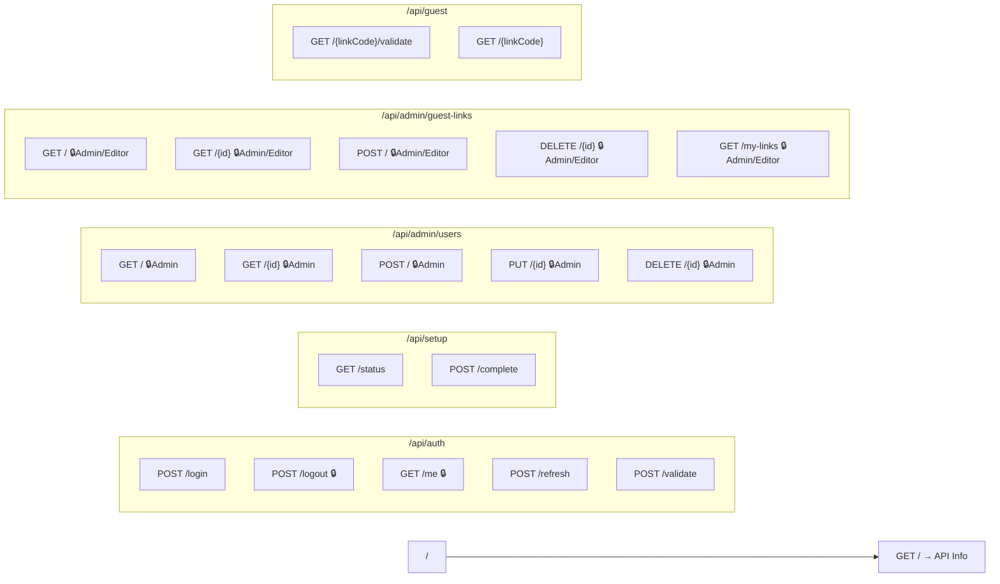
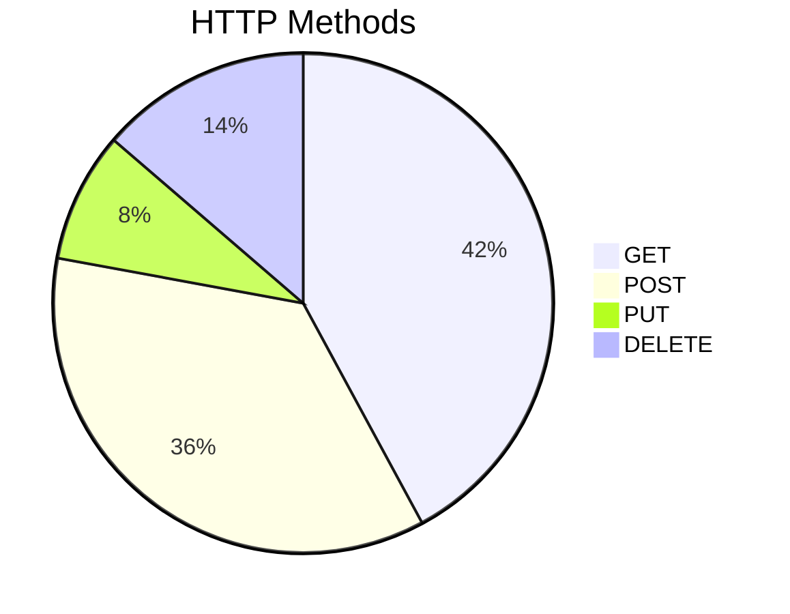
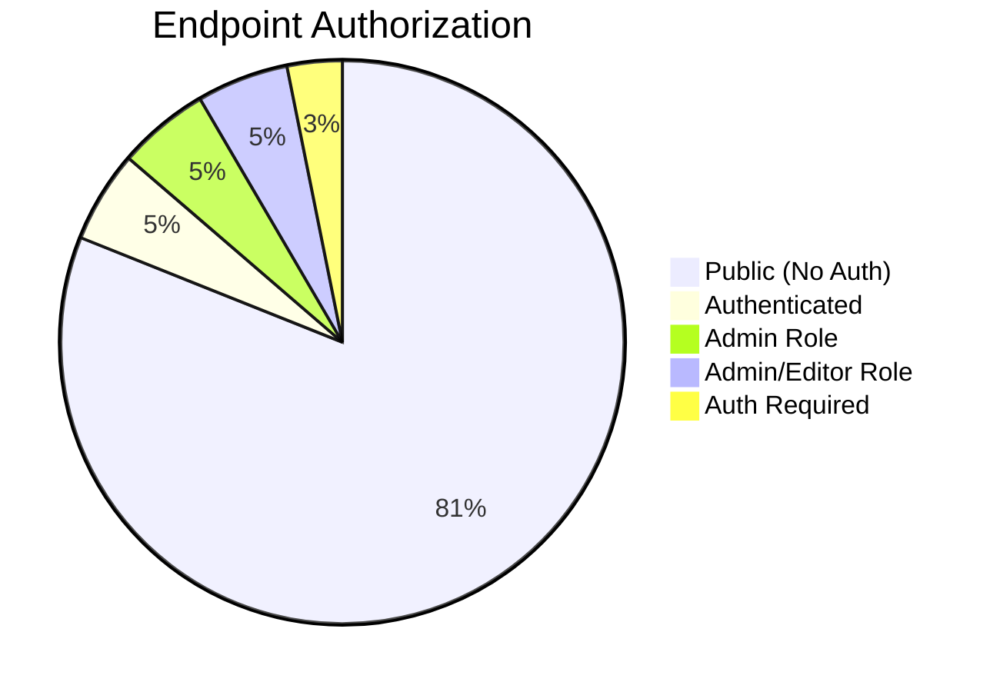

# LibraFoto API — Endpoint Map

> **Total: 94 endpoints** across 5 modules + 1 root endpoint

## Summary

| Module      | Group                | Endpoints |
| ----------- | -------------------- | :-------: |
| **Auth**    | Authentication       |     5     |
| **Auth**    | Setup                |     2     |
| **Auth**    | User Management      |     5     |
| **Auth**    | Guest Links (Admin)  |     5     |
| **Auth**    | Guest Links (Public) |     2     |
| **Admin**   | Photos               |    10     |
| **Admin**   | Albums               |    10     |
| **Admin**   | Tags                 |     7     |
| **Admin**   | System               |     4     |
| **Display** | Slideshow            |     5     |
| **Display** | Display Settings     |     7     |
| **Display** | Display Config       |     1     |
| **Media**   | Photos               |     1     |
| **Media**   | Thumbnails           |     4     |
| **Media**   | Metadata             |     2     |
| **Storage** | Providers            |     7     |
| **Storage** | Sync                 |     5     |
| **Storage** | Upload               |     2     |
| **Storage** | Guest Upload         |     1     |
| **Storage** | File Access          |     1     |
| **Storage** | Google Photos OAuth  |     2     |
| **Storage** | Google Photos Picker |     6     |
| **Root**    | API Info             |     1     |
|             | **Total**            |  **95**   |

## Endpoint Route Map

---

## Auth Module (19 endpoints)

### Authentication — `/api/auth` — Tag: "Authentication"

| Method | Route                | Name             | Auth | Description                                                   |
| ------ | -------------------- | ---------------- | :--: | ------------------------------------------------------------- |
| `POST` | `/api/auth/login`    | `Login`          |  —   | Authenticate with email/password; returns JWT + refresh token |
| `POST` | `/api/auth/logout`   | `Logout`         |  🔒  | Invalidate current user's refresh tokens                      |
| `GET`  | `/api/auth/me`       | `GetCurrentUser` |  🔒  | Get authenticated user's profile                              |
| `POST` | `/api/auth/refresh`  | `RefreshToken`   |  —   | Exchange refresh token for new access token                   |
| `POST` | `/api/auth/validate` | `ValidateToken`  |  —   | Validate a JWT from Authorization header                      |

### Setup — `/api/setup` — Tag: "Setup"

| Method | Route                 | Name             | Auth | Description                                        |
| ------ | --------------------- | ---------------- | :--: | -------------------------------------------------- |
| `GET`  | `/api/setup/status`   | `GetSetupStatus` |  —   | Check if initial setup is required                 |
| `POST` | `/api/setup/complete` | `CompleteSetup`  |  —   | Create first admin user (only when no users exist) |

### User Management — `/api/admin/users` — Tag: "User Management"

| Method   | Route                   | Name          |   Auth   | Description                        |
| -------- | ----------------------- | ------------- | :------: | ---------------------------------- |
| `GET`    | `/api/admin/users`      | `GetUsers`    | 🔒 Admin | Paginated list of all users        |
| `GET`    | `/api/admin/users/{id}` | `GetUserById` | 🔒 Admin | Get a specific user                |
| `POST`   | `/api/admin/users`      | `CreateUser`  | 🔒 Admin | Create a new user                  |
| `PUT`    | `/api/admin/users/{id}` | `UpdateUser`  | 🔒 Admin | Update a user                      |
| `DELETE` | `/api/admin/users/{id}` | `DeleteUser`  | 🔒 Admin | Delete a user (cannot delete self) |

### Guest Link Management (Admin) — `/api/admin/guest-links` — Tag: "Guest Link Management"

| Method   | Route                             | Name               |      Auth       | Description                    |
| -------- | --------------------------------- | ------------------ | :-------------: | ------------------------------ |
| `GET`    | `/api/admin/guest-links`          | `GetGuestLinks`    | 🔒 Admin/Editor | Paginated list of guest links  |
| `GET`    | `/api/admin/guest-links/{id}`     | `GetGuestLinkById` | 🔒 Admin/Editor | Get a specific guest link      |
| `POST`   | `/api/admin/guest-links`          | `CreateGuestLink`  | 🔒 Admin/Editor | Create a guest upload link     |
| `DELETE` | `/api/admin/guest-links/{id}`     | `DeleteGuestLink`  | 🔒 Admin/Editor | Delete a guest link            |
| `GET`    | `/api/admin/guest-links/my-links` | `GetMyGuestLinks`  | 🔒 Admin/Editor | Get current user's guest links |

### Guest Access (Public) — `/api/guest` — Tag: "Guest Access"

| Method | Route                            | Name                | Auth | Description                        |
| ------ | -------------------------------- | ------------------- | :--: | ---------------------------------- |
| `GET`  | `/api/guest/{linkCode}/validate` | `ValidateGuestLink` |  —   | Validate a guest link code         |
| `GET`  | `/api/guest/{linkCode}`          | `GetGuestLinkInfo`  |  —   | Get public info about a guest link |

---

## Admin Module (31 endpoints)

### Photos — `/api/admin/photos` — Tag: "Photos"

| Method   | Route                                                | Name                  | Auth | Description                                                                    |
| -------- | ---------------------------------------------------- | --------------------- | :--: | ------------------------------------------------------------------------------ |
| `GET`    | `/api/admin/photos`                                  | `GetPhotos`           |  —   | Paginated photo list with filters (album, tag, date, media type, search, sort) |
| `GET`    | `/api/admin/photos/count`                            | `GetAdminPhotoCount`  |  —   | Total photo count                                                              |
| `GET`    | `/api/admin/photos/{id}`                             | `GetPhotoById`        |  —   | Full photo details                                                             |
| `PUT`    | `/api/admin/photos/{id}`                             | `UpdatePhoto`         |  —   | Update photo metadata                                                          |
| `DELETE` | `/api/admin/photos/{id}`                             | `DeletePhoto`         |  —   | Delete a photo (DB + files + thumbnails)                                       |
| `POST`   | `/api/admin/photos/bulk/delete`                      | `BulkDeletePhotos`    |  —   | Delete multiple photos                                                         |
| `POST`   | `/api/admin/photos/bulk/add-to-album/{albumId}`      | `BulkAddToAlbum`      |  —   | Add photos to an album                                                         |
| `POST`   | `/api/admin/photos/bulk/remove-from-album/{albumId}` | `BulkRemoveFromAlbum` |  —   | Remove photos from an album                                                    |
| `POST`   | `/api/admin/photos/bulk/add-tags`                    | `BulkAddTags`         |  —   | Add tags to multiple photos                                                    |
| `POST`   | `/api/admin/photos/bulk/remove-tags`                 | `BulkRemoveTags`      |  —   | Remove tags from multiple photos                                               |

### Albums — `/api/admin/albums` — Tag: "Albums"

| Method   | Route                                    | Name                    | Auth | Description                        |
| -------- | ---------------------------------------- | ----------------------- | :--: | ---------------------------------- |
| `GET`    | `/api/admin/albums`                      | `GetAlbums`             |  —   | List all albums                    |
| `GET`    | `/api/admin/albums/{id}`                 | `GetAlbumById`          |  —   | Get album by ID                    |
| `POST`   | `/api/admin/albums`                      | `CreateAlbum`           |  —   | Create a new album                 |
| `PUT`    | `/api/admin/albums/{id}`                 | `UpdateAlbum`           |  —   | Update album details               |
| `DELETE` | `/api/admin/albums/{id}`                 | `DeleteAlbum`           |  —   | Delete an album (photos preserved) |
| `PUT`    | `/api/admin/albums/{id}/cover/{photoId}` | `SetAlbumCoverPhoto`    |  —   | Set album cover photo              |
| `DELETE` | `/api/admin/albums/{id}/cover`           | `RemoveAlbumCoverPhoto` |  —   | Remove album cover photo           |
| `POST`   | `/api/admin/albums/{id}/photos`          | `AddPhotosToAlbum`      |  —   | Add photos to album                |
| `DELETE` | `/api/admin/albums/{id}/photos`          | `RemovePhotosFromAlbum` |  —   | Remove photos from album           |
| `PUT`    | `/api/admin/albums/{id}/photos/reorder`  | `ReorderPhotosInAlbum`  |  —   | Reorder photos in album            |

### Tags — `/api/admin/tags` — Tag: "Tags"

| Method   | Route                         | Name                  | Auth | Description              |
| -------- | ----------------------------- | --------------------- | :--: | ------------------------ |
| `GET`    | `/api/admin/tags`             | `GetTags`             |  —   | List all tags            |
| `GET`    | `/api/admin/tags/{id}`        | `GetTagById`          |  —   | Get tag by ID            |
| `POST`   | `/api/admin/tags`             | `CreateTag`           |  —   | Create a new tag         |
| `PUT`    | `/api/admin/tags/{id}`        | `UpdateTag`           |  —   | Update tag name/color    |
| `DELETE` | `/api/admin/tags/{id}`        | `DeleteTag`           |  —   | Delete a tag             |
| `POST`   | `/api/admin/tags/{id}/photos` | `AddPhotosToTag`      |  —   | Add photos to a tag      |
| `DELETE` | `/api/admin/tags/{id}/photos` | `RemovePhotosFromTag` |  —   | Remove photos from a tag |

### System — `/api/admin/system` — Tag: "System"

| Method | Route                             | Name                   | Auth | Description                                  |
| ------ | --------------------------------- | ---------------------- | :--: | -------------------------------------------- |
| `GET`  | `/api/admin/system/info`          | `GetSystemInfo`        |  —   | System info (version, uptime, Docker status) |
| `GET`  | `/api/admin/system/updates`       | `CheckForUpdates`      |  —   | Check for updates (cached, 30-min TTL)       |
| `POST` | `/api/admin/system/updates/check` | `ForceCheckForUpdates` |  —   | Force update check (bypass cache)            |
| `POST` | `/api/admin/system/update`        | `TriggerUpdate`        |  —   | Trigger application update                   |

---

## Display Module (13 endpoints)

### Slideshow — `/api/display/photos` — Tag: "Slideshow"

| Method | Route                         | Name                     | Auth | Description                               |
| ------ | ----------------------------- | ------------------------ | :--: | ----------------------------------------- |
| `GET`  | `/api/display/photos/next`    | `GetNextPhoto`           |  —   | Get next photo in slideshow sequence      |
| `GET`  | `/api/display/photos/current` | `GetCurrentPhoto`        |  —   | Get currently displayed photo             |
| `GET`  | `/api/display/photos/preload` | `GetPreloadPhotos`       |  —   | Get upcoming photos for preloading (1-50) |
| `GET`  | `/api/display/photos/count`   | `GetDisplayPhotoCount`   |  —   | Count available slideshow photos          |
| `POST` | `/api/display/photos/reset`   | `ResetSlideshowSequence` |  —   | Reset slideshow to beginning              |

### Display Settings — `/api/display/settings` — Tag: "Display Settings"

| Method   | Route                                 | Name                       | Auth | Description                      |
| -------- | ------------------------------------- | -------------------------- | :--: | -------------------------------- |
| `GET`    | `/api/display/settings`               | `GetActiveDisplaySettings` |  —   | Get active display settings      |
| `GET`    | `/api/display/settings/all`           | `GetAllDisplaySettings`    |  —   | Get all display configurations   |
| `GET`    | `/api/display/settings/{id}`          | `GetDisplaySettingsById`   |  —   | Get settings by ID               |
| `PUT`    | `/api/display/settings/{id}`          | `UpdateDisplaySettings`    |  —   | Update display settings          |
| `POST`   | `/api/display/settings`               | `CreateDisplaySettings`    |  —   | Create new display configuration |
| `DELETE` | `/api/display/settings/{id}`          | `DeleteDisplaySettings`    |  —   | Delete display configuration     |
| `POST`   | `/api/display/settings/{id}/activate` | `ActivateDisplaySettings`  |  —   | Activate a display configuration |

### Display Config — `/api/display/config` — Tag: "DisplayConfig"

| Method | Route                 | Name               | Auth | Description                                    |
| ------ | --------------------- | ------------------ | :--: | ---------------------------------------------- |
| `GET`  | `/api/display/config` | `GetDisplayConfig` |  —   | Get display frontend config (admin URL for QR) |

---

## Media Module (7 endpoints)

### Photo Files — `/api/media/photos` — Tag: (none)

| Method | Route                         | Name       | Auth | Description                                      |
| ------ | ----------------------------- | ---------- | :--: | ------------------------------------------------ |
| `GET`  | `/api/media/photos/{photoId}` | `GetPhoto` |  —   | Serve full-size photo/video file (range support) |

### Thumbnails — `/api/media/thumbnails` — Tag: (none)

| Method | Route                                      | Name                | Auth | Description                                            |
| ------ | ------------------------------------------ | ------------------- | :--: | ------------------------------------------------------ |
| `GET`  | `/api/media/thumbnails/{photoId}`          | `GetThumbnail`      |  —   | Get 400×400 JPEG thumbnail (auto-generates if missing) |
| `POST` | `/api/media/thumbnails/{photoId}/generate` | `GenerateThumbnail` |  🔒  | Generate thumbnail from source file path               |
| `POST` | `/api/media/thumbnails/{photoId}/refresh`  | `RefreshThumbnail`  |  🔒  | Delete and regenerate a thumbnail                      |
| `POST` | `/api/media/thumbnails/refresh`            | `RefreshThumbnails` |  🔒  | Batch refresh thumbnails for multiple photos           |

### Metadata — `/api/media/metadata` — Tag: (none)

| Method | Route                         | Name                      | Auth | Description                                 |
| ------ | ----------------------------- | ------------------------- | :--: | ------------------------------------------- |
| `POST` | `/api/media/metadata/extract` | `ExtractMetadata`         |  —   | Extract EXIF/GPS from uploaded file         |
| `GET`  | `/api/media/metadata/file`    | `ExtractMetadataFromPath` |  🔒  | Extract metadata from server-side file path |

---

## Storage Module (24 endpoints)

### Storage Providers — `/api/admin/storage/providers` — Tag: "Storage Providers"

| Method   | Route                                          | Name                            | Auth | Description                              |
| -------- | ---------------------------------------------- | ------------------------------- | :--: | ---------------------------------------- |
| `GET`    | `/api/admin/storage/providers`                 | `GetStorageProviders`           |  —   | List all storage providers               |
| `GET`    | `/api/admin/storage/providers/{id}`            | `GetStorageProvider`            |  —   | Get provider by ID                       |
| `POST`   | `/api/admin/storage/providers`                 | `CreateStorageProvider`         |  —   | Create storage provider                  |
| `PUT`    | `/api/admin/storage/providers/{id}`            | `UpdateStorageProvider`         |  —   | Update provider config                   |
| `DELETE` | `/api/admin/storage/providers/{id}`            | `DeleteStorageProvider`         |  —   | Delete provider (optional photo cleanup) |
| `POST`   | `/api/admin/storage/providers/{id}/disconnect` | `DisconnectStorageProvider`     |  —   | Clear OAuth tokens and disable           |
| `POST`   | `/api/admin/storage/providers/{id}/test`       | `TestStorageProviderConnection` |  —   | Test provider connection                 |

### Storage Sync — `/api/admin/storage/sync` — Tag: "Storage Sync"

| Method | Route                                 | Name             | Auth | Description                          |
| ------ | ------------------------------------- | ---------------- | :--: | ------------------------------------ |
| `POST` | `/api/admin/storage/sync/{id}`        | `TriggerSync`    |  —   | Start sync for a provider            |
| `POST` | `/api/admin/storage/sync/all`         | `TriggerSyncAll` |  —   | Sync all enabled providers           |
| `GET`  | `/api/admin/storage/sync/{id}/status` | `GetSyncStatus`  |  —   | Get sync progress                    |
| `POST` | `/api/admin/storage/sync/{id}/cancel` | `CancelSync`     |  —   | Cancel in-progress sync              |
| `GET`  | `/api/admin/storage/sync/{id}/scan`   | `ScanProvider`   |  —   | Scan for new files without importing |

### Upload — `/api/admin/upload` — Tag: "Upload"

| Method | Route                     | Name          | Auth | Description                            |
| ------ | ------------------------- | ------------- | :--: | -------------------------------------- |
| `POST` | `/api/admin/upload`       | `UploadFile`  |  —   | Upload single photo/video (100 MB max) |
| `POST` | `/api/admin/upload/batch` | `UploadBatch` |  —   | Upload multiple files                  |

### Guest Upload — `/api/guest/upload` — Tag: "Guest Upload"

| Method | Route                        | Name          | Auth | Description                 |
| ------ | ---------------------------- | ------------- | :--: | --------------------------- |
| `POST` | `/api/guest/upload/{linkId}` | `GuestUpload` |  —   | Upload files via guest link |

### File Access — `/api/files` — Tag: "Files"

| Method | Route                                | Name      | Auth | Description                         |
| ------ | ------------------------------------ | --------- | :--: | ----------------------------------- |
| `GET`  | `/api/files/{providerId}/{**fileId}` | `GetFile` |  —   | Retrieve file from storage provider |

### Google Photos OAuth — `/api/storage/google-photos` — Tag: "Storage - Google Photos OAuth"

| Method | Route                                                   | Name                        | Auth | Description                 |
| ------ | ------------------------------------------------------- | --------------------------- | :--: | --------------------------- |
| `GET`  | `/api/storage/google-photos/{providerId}/authorize-url` | `GetGooglePhotosAuthUrl`    |  —   | Get OAuth authorization URL |
| `POST` | `/api/storage/google-photos/{providerId}/callback`      | `GooglePhotosOAuthCallback` |  —   | Handle OAuth callback       |

### Google Photos Picker — `/api/storage/google-photos` — Tag: "Storage - Google Photos Picker"

| Method   | Route                                                                                          | Name                              | Auth | Description               |
| -------- | ---------------------------------------------------------------------------------------------- | --------------------------------- | :--: | ------------------------- |
| `POST`   | `/api/storage/google-photos/{providerId}/picker/start`                                         | `StartGooglePhotosPickerSession`  |  —   | Start picker session      |
| `GET`    | `/api/storage/google-photos/{providerId}/picker/sessions/{sessionId}`                          | `GetGooglePhotosPickerSession`    |  —   | Get picker session status |
| `GET`    | `/api/storage/google-photos/{providerId}/picker/sessions/{sessionId}/items`                    | `GetGooglePhotosPickerItems`      |  —   | Get picked media items    |
| `POST`   | `/api/storage/google-photos/{providerId}/picker/sessions/{sessionId}/import`                   | `ImportGooglePhotosPickerItems`   |  —   | Import picked items       |
| `DELETE` | `/api/storage/google-photos/{providerId}/picker/sessions/{sessionId}`                          | `DeleteGooglePhotosPickerSession` |  —   | Delete picker session     |
| `GET`    | `/api/storage/google-photos/{providerId}/picker/sessions/{sessionId}/items/{itemId}/thumbnail` | `GetGooglePhotosPickerThumbnail`  |  —   | Get picker item thumbnail |

---

## Root

| Method | Route | Name | Auth | Description               |
| ------ | ----- | ---- | :--: | ------------------------- |
| `GET`  | `/`   | —    |  —   | API info (name + version) |

---

## HTTP Methods Distribution

## Authorization Overview

> **Note:** Many Admin and Storage module endpoints have `.RequireAuthorization()` currently **commented out** in the codebase. The counts above reflect the current runtime behavior where most endpoints are publicly accessible.
