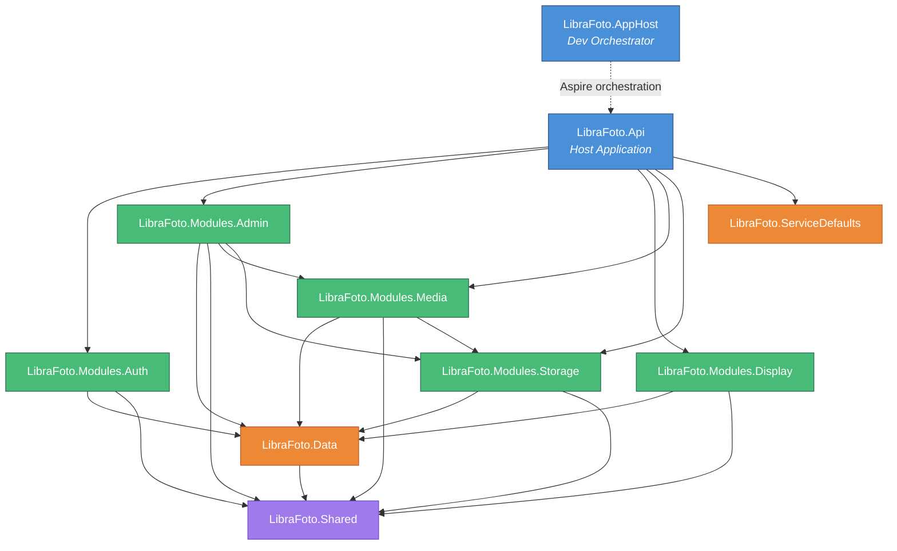
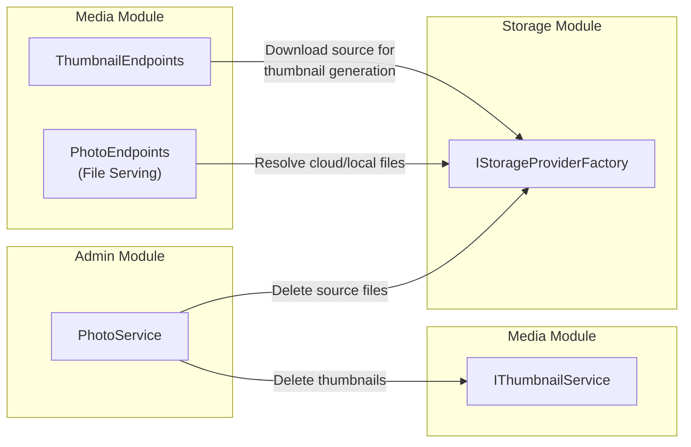
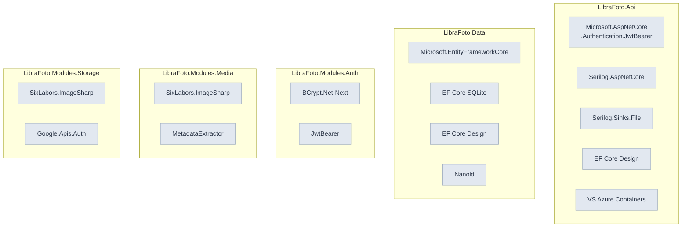

# LibraFoto API — Module Dependencies

## Project Dependency Graph

## Dependency Matrix

| Project ↓ depends on → | Data | Shared | Auth | Admin | Display | Media | Storage | ServiceDefaults |
| ---------------------- | :--: | :----: | :--: | :---: | :-----: | :---: | :-----: | :-------------: |
| **LibraFoto.Api**      |  —   |   —    |  ✓   |   ✓   |    ✓    |   ✓   |    ✓    |        ✓        |
| **Modules.Auth**       |  ✓   |   ✓    |  —   |   —   |    —    |   —   |    —    |        —        |
| **Modules.Admin**      |  ✓   |   ✓    |  —   |   —   |    —    |   ✓   |    ✓    |        —        |
| **Modules.Display**    |  ✓   |   ✓    |  —   |   —   |    —    |   —   |    —    |        —        |
| **Modules.Media**      |  ✓   |   ✓    |  —   |   —   |    —    |   —   |    ✓    |        —        |
| **Modules.Storage**    |  ✓   |   ✓    |  —   |   —   |    —    |   —   |    —    |        —        |
| **LibraFoto.Data**     |  —   |   ✓    |  —   |   —   |    —    |   —   |    —    |        —        |

## Cross-Module Service Dependencies

## NuGet Package Dependencies

## Service Registration & Lifetimes

```mermaid
graph TD
    subgraph "Singleton Services"
        direction LR
        SystemService["SystemService"]
        MediaScannerService["MediaScannerService"]
        MemoryCache["IMemoryCache"]
    end

    subgraph "Scoped Services (per-request)"
        direction LR
        PhotoService["PhotoService"]
        AlbumService["AlbumService"]
        TagService["TagService"]
        AuthService["AuthService"]
        UserService["UserService"]
        SetupService["SetupService"]
        GuestLinkService["GuestLinkService"]
        DisplaySettingsService["DisplaySettingsService"]
        SlideshowService["SlideshowService"]
        ThumbnailService["ThumbnailService"]
        MetadataService["MetadataService"]
        ImageProcessor["ImageProcessor"]
        GeocodingService["GeocodingService"]
        StorageProviderFactory["StorageProviderFactory"]
        SyncService["SyncService"]
        ImageImportService["ImageImportService"]
        GooglePickerService["GooglePhotosPickerService"]
    end

    subgraph "Transient (Factory-Created)"
        direction LR
        LocalProvider["LocalStorageProvider"]
        GoogleProvider["GooglePhotosProvider"]
    end

    StorageProviderFactory -->|"Creates"| LocalProvider
    StorageProviderFactory -->|"Creates"| GoogleProvider

    classDef singleton fill:#fc8181,stroke:#c53030,color:#fff
    classDef scoped fill:#63b3ed,stroke:#2b6cb0,color:#fff
    classDef transient fill:#68d391,stroke:#276749,color:#fff

    class SystemService,MediaScannerService,MemoryCache singleton
    class PhotoService,AlbumService,TagService,AuthService,UserService,SetupService,GuestLinkService,DisplaySettingsService,SlideshowService,ThumbnailService,MetadataService,ImageProcessor,GeocodingService,StorageProviderFactory,SyncService,ImageImportService,GooglePickerService scoped
    class LocalProvider,GoogleProvider transient
```

