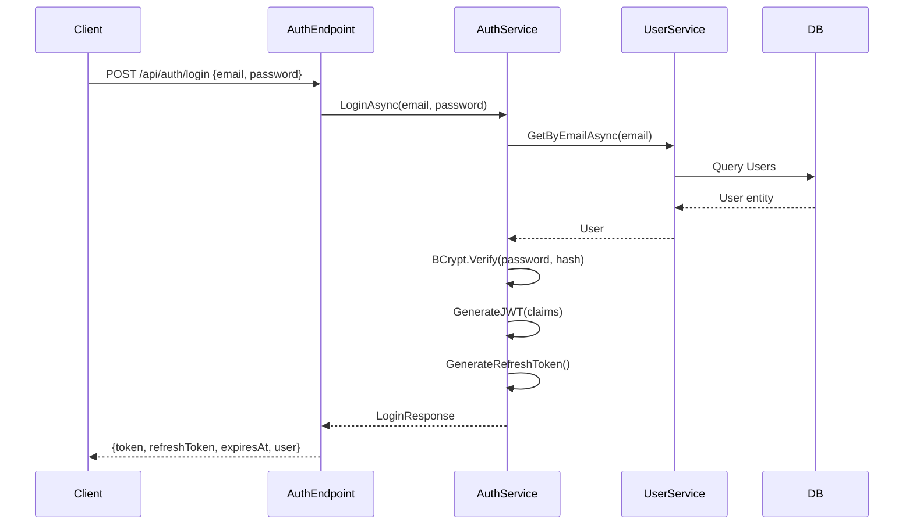
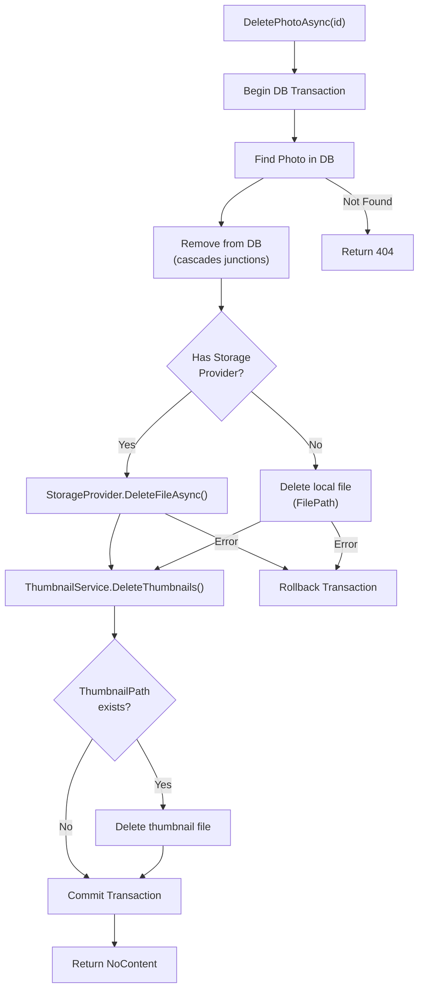
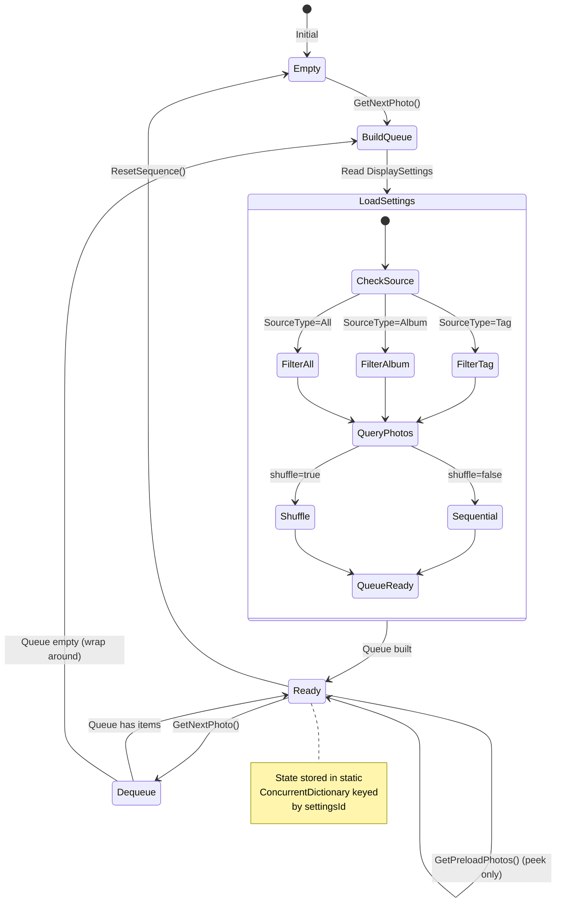
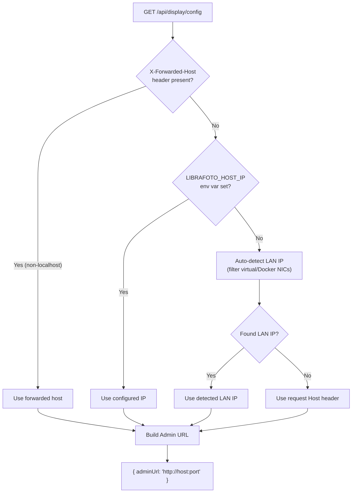
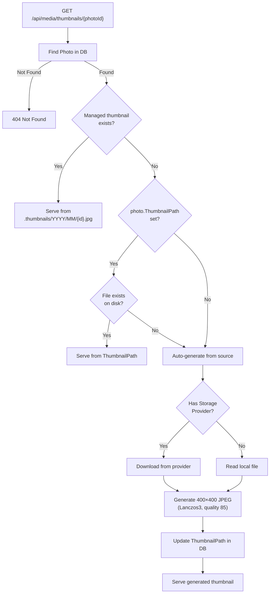

# LibraFoto API — Module Details

## Auth Module

### Services

| Service             | Implementation     | Lifetime | Purpose                                                                |
| ------------------- | ------------------ | -------- | ---------------------------------------------------------------------- |
| `IAuthService`      | `AuthService`      | Scoped   | JWT authentication: login, logout, token generation/validation/refresh |
| `IUserService`      | `UserService`      | Scoped   | User CRUD, password hashing (BCrypt), email uniqueness                 |
| `ISetupService`     | `SetupService`     | Scoped   | First-run setup: creates initial Admin user                            |
| `IGuestLinkService` | `GuestLinkService` | Scoped   | Guest upload link CRUD, validation, upload tracking                    |

### Auth Flow

### JWT Claims

| Claim            | Source           | Description                       |
| ---------------- | ---------------- | --------------------------------- |
| `NameIdentifier` | `User.Id`        | User's database ID                |
| `Name`           | `User.Email`     | User's email address              |
| `Email`          | `User.Email`     | Duplicate for compatibility       |
| `Role`           | `User.Role`      | Role name (Admin/Editor/Guest)    |
| `role_level`     | `(int)User.Role` | Integer role level for comparison |

---

## Admin Module

### Services

| Service          | Implementation  | Lifetime  | Dependencies                                          | Purpose                                          |
| ---------------- | --------------- | --------- | ----------------------------------------------------- | ------------------------------------------------ |
| `IPhotoService`  | `PhotoService`  | Scoped    | DbContext, IThumbnailService, IStorageProviderFactory | Photo CRUD, bulk operations, file cleanup        |
| `IAlbumService`  | `AlbumService`  | Scoped    | DbContext                                             | Album CRUD, photo ordering, cover photos         |
| `ITagService`    | `TagService`    | Scoped    | DbContext                                             | Tag CRUD, photo-tag associations                 |
| `ISystemService` | `SystemService` | Singleton | IMemoryCache, IHostEnvironment                        | System info, update checks (git), update trigger |

### Photo Delete Flow

---

## Display Module

### Services

| Service                   | Implementation           | Lifetime | Purpose                                                             |
| ------------------------- | ------------------------ | -------- | ------------------------------------------------------------------- |
| `IDisplaySettingsService` | `DisplaySettingsService` | Scoped   | Display settings CRUD, auto-default creation, activation management |
| `ISlideshowService`       | `SlideshowService`       | Scoped   | Photo queue management, sequence control, preloading                |

### Slideshow State Machine

### Display Config Resolution

---

## Media Module

### Services

| Service             | Implementation     | Lifetime | Dependencies               | Purpose                                                         |
| ------------------- | ------------------ | -------- | -------------------------- | --------------------------------------------------------------- |
| `IThumbnailService` | `ThumbnailService` | Scoped   | ImageSharp, IConfiguration | 400×400 JPEG thumbnails, year/month directory structure         |
| `IMetadataService`  | `MetadataService`  | Scoped   | MetadataExtractor          | EXIF/GPS extraction from images                                 |
| `IImageProcessor`   | `ImageProcessor`   | Scoped   | ImageSharp                 | General image processing (resize, rotate, convert, auto-orient) |
| `IGeocodingService` | `GeocodingService` | Scoped   | HttpClient (Nominatim)     | Reverse geocoding with rate limiting (1 req/sec, 60 req/min)    |

### Thumbnail Resolution

---

## Storage Module

### Services

| Service                     | Implementation           | Lifetime  | Purpose                                   |
| --------------------------- | ------------------------ | --------- | ----------------------------------------- |
| `IStorageProviderFactory`   | `StorageProviderFactory` | Scoped    | Creates/caches storage provider instances |
| `IMediaScannerService`      | `MediaScannerService`    | Singleton | Directory scanning, file type detection   |
| `ISyncService`              | `SyncService`            | Scoped    | Provider ↔ DB synchronization engine      |
| `IImageImportService`       | `ImageImportService`     | Scoped    | Image processing during import            |
| `GooglePhotosPickerService` | (concrete)               | Scoped    | Google Photos Picker API client           |

### Supported File Types

| Category   | Extensions                                                  |
| ---------- | ----------------------------------------------------------- |
| **Images** | jpg, jpeg, png, gif, webp, bmp, tiff, tif, heic, heif, avif |
| **Videos** | mp4, mov, avi, mkv, webm, m4v, 3gp, wmv, flv                |
