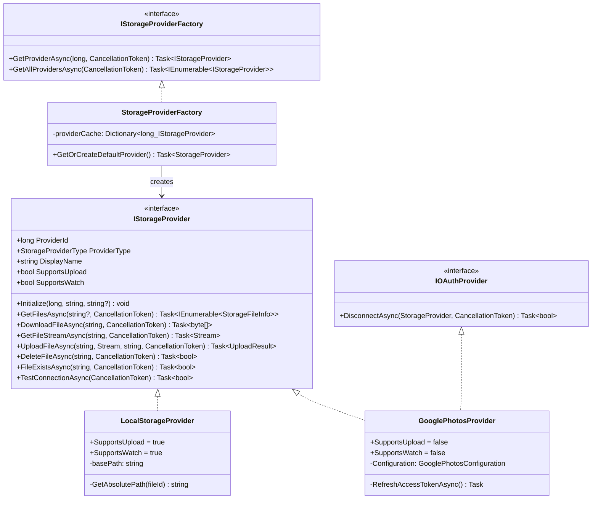
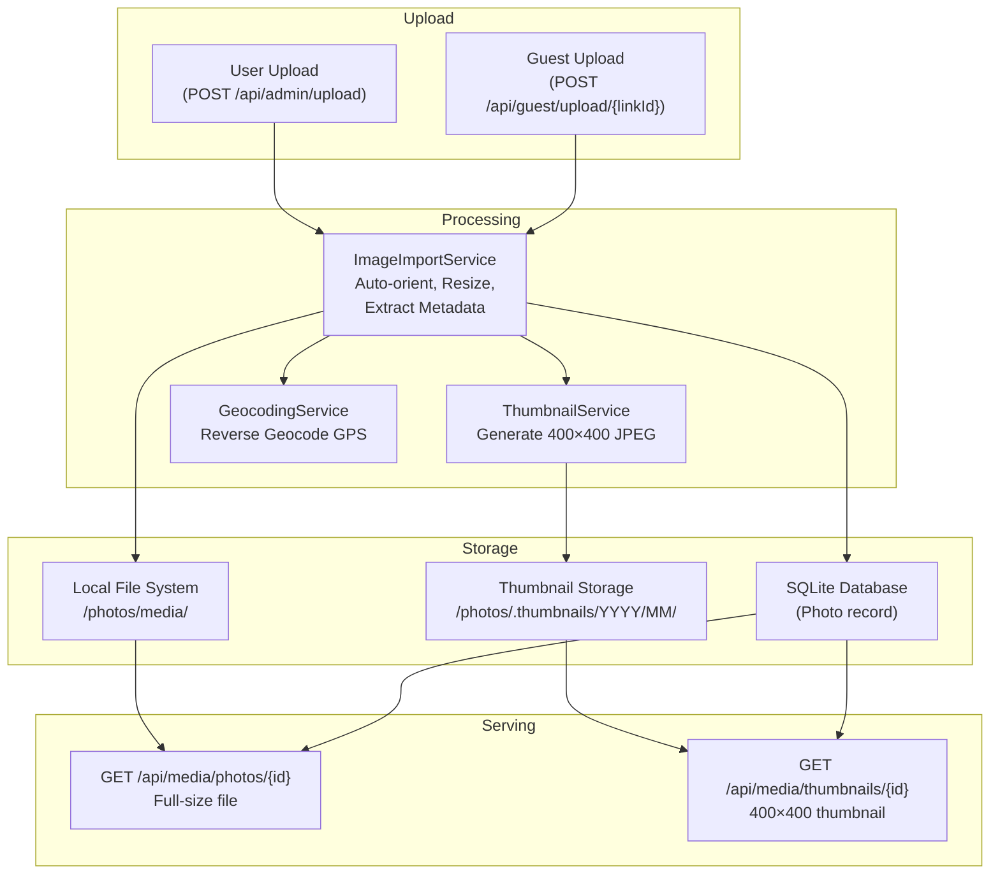
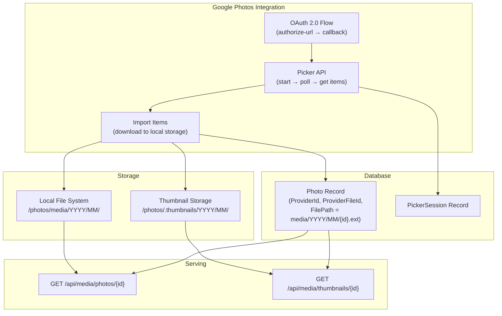
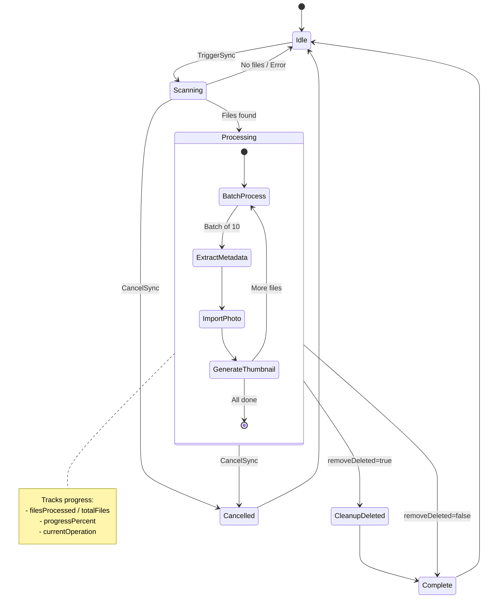

# LibraFoto API — Storage Architecture

## Storage Provider Pattern

```mermaid
classDiagram
    class IStorageProvider {
        <<interface>>
        +long ProviderId
        +StorageProviderType ProviderType
        +string DisplayName
        +bool SupportsUpload
        +bool SupportsWatch
        +Initialize(long, string, string?) void
        +GetFilesAsync(string?, CancellationToken) Task~IEnumerable~StorageFileInfo~~
        +DownloadFileAsync(string, CancellationToken) Task~byte[]~
        +GetFileStreamAsync(string, CancellationToken) Task~Stream~
        +UploadFileAsync(string, Stream, string, CancellationToken) Task~UploadResult~
        +DeleteFileAsync(string, CancellationToken) Task~bool~
        +FileExistsAsync(string, CancellationToken) Task~bool~
        +TestConnectionAsync(CancellationToken) Task~bool~
    }

    class IOAuthProvider {
        <<interface>>
        +DisconnectAsync(StorageProvider, CancellationToken) Task~bool~
    }

    class LocalStorageProvider {
        +SupportsUpload = true
        +SupportsWatch = true
        -basePath: string
        -GetAbsolutePath(fileId) string
    }

    class GooglePhotosProvider {
        +SupportsUpload = false
        +SupportsWatch = false
        -Configuration: GooglePhotosConfiguration
        -RefreshAccessTokenAsync() Task
    }

    class IStorageProviderFactory {
        <<interface>>
        +GetProviderAsync(long, CancellationToken) Task~IStorageProvider~
        +GetAllProvidersAsync(CancellationToken) Task~IEnumerable~IStorageProvider~~
    }

    class StorageProviderFactory {
        -providerCache: Dictionary~long_IStorageProvider~
        +GetOrCreateDefaultProvider() Task~StorageProvider~
    }

    IStorageProvider <|.. LocalStorageProvider
    IStorageProvider <|.. GooglePhotosProvider
    IOAuthProvider <|.. GooglePhotosProvider
    IStorageProviderFactory <|.. StorageProviderFactory
    StorageProviderFactory --> IStorageProvider : creates
```

## File Flow: Upload to Display

```mermaid
flowchart TD
    subgraph Upload
        UserUpload["User Upload<br/>(POST /api/admin/upload)"]
        GuestUpload["Guest Upload<br/>(POST /api/guest/upload/{linkId})"]
    end

    subgraph Processing
        ImageImport["ImageImportService<br/>Auto-orient, Resize,<br/>Extract Metadata"]
        ThumbnailGen["ThumbnailService<br/>Generate 400×400 JPEG"]
        Geocoding["GeocodingService<br/>Reverse Geocode GPS"]
    end

    subgraph Storage
        LocalFS["Local File System<br/>/photos/media/"]
        ThumbnailFS["Thumbnail Storage<br/>/photos/.thumbnails/YYYY/MM/"]
        DB["SQLite Database<br/>(Photo record)"]
    end

    subgraph Serving
        PhotoServe["GET /api/media/photos/{id}<br/>Full-size file"]
        ThumbServe["GET /api/media/thumbnails/{id}<br/>400×400 thumbnail"]
    end

    UserUpload --> ImageImport
    GuestUpload --> ImageImport
    ImageImport --> LocalFS
    ImageImport --> ThumbnailGen
    ImageImport --> Geocoding
    ImageImport --> DB
    ThumbnailGen --> ThumbnailFS

    LocalFS --> PhotoServe
    ThumbnailFS --> ThumbServe
    DB --> PhotoServe
    DB --> ThumbServe
```

## File Flow: Cloud Provider (Google Photos)

```mermaid
flowchart TD
    subgraph "Google Photos Integration"
        OAuth["OAuth 2.0 Flow<br/>(authorize-url → callback)"]
        Picker["Picker API<br/>(start → poll → get items)"]
        Import["Import Items<br/>(download to local storage)"]
    end

    subgraph Storage
        LocalFS["Local File System<br/>/photos/media/YYYY/MM/"]
        ThumbnailFS["Thumbnail Storage<br/>/photos/.thumbnails/YYYY/MM/"]
    end

    subgraph "Database"
        PhotoRecord["Photo Record<br/>(ProviderId, ProviderFileId,<br/>FilePath = media/YYYY/MM/{id}.ext)"]
        PickerSessionRecord["PickerSession Record"]
    end

    subgraph "Serving"
        MediaEndpoint["GET /api/media/photos/{id}"]
        ThumbEndpoint["GET /api/media/thumbnails/{id}"]
    end

    OAuth --> Picker
    Picker --> PickerSessionRecord
    Picker --> Import
    Import --> LocalFS
    Import --> ThumbnailFS
    Import --> PhotoRecord

    LocalFS --> MediaEndpoint
    ThumbnailFS --> ThumbEndpoint
    PhotoRecord --> MediaEndpoint
    PhotoRecord --> ThumbEndpoint
```

## Sync Engine

```mermaid
stateDiagram-v2
    [*] --> Idle
    Idle --> Scanning: TriggerSync
    Scanning --> Processing: Files found
    Scanning --> Idle: No files / Error

    state Processing {
        [*] --> BatchProcess
        BatchProcess --> ExtractMetadata: Batch of 10
        ExtractMetadata --> ImportPhoto
        ImportPhoto --> GenerateThumbnail
        GenerateThumbnail --> BatchProcess: More files
        GenerateThumbnail --> [*]: All done
    }

    Processing --> CleanupDeleted: removeDeleted=true
    Processing --> Complete: removeDeleted=false
    CleanupDeleted --> Complete
    Complete --> Idle

    Scanning --> Cancelled: CancelSync
    Processing --> Cancelled: CancelSync
    Cancelled --> Idle

    note right of Processing
        Tracks progress:
        - filesProcessed / totalFiles
        - progressPercent
        - currentOperation
    end note
```
